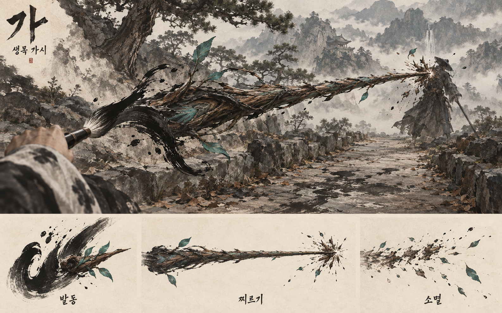

# 가 — 한 획에서 돋는 생목

상태: CONCEPT / 사용자 승인 대기. 실제 게임 구현·변경 전 제안이다.

## 근거

- Docs/오행부_작도어휘_v0_1.csv: 단일 대상에 곧게 뻗는 생목 가시(근중거리).
- Art Bible ART-CHARTER / ART-COLOR / ART-INK / ART-SILHOUETTE: 수묵담채, 저채도 세계와 의미 있는 색, 목의 생죽색, 먹 농도·번짐·획 굵기, 읽히는 실루엣.
- SPEC-SPELL-FIDELITY: 글자 자리에서 대상까지 곧게 뻗는 문법.
- SPEC-SPELL-VFX120: 개시·진행·착탄·소멸, 생장과 굽힘, 한국 회화·공예의 형태, 인식·피해·가드 시계 불개입.
- 최신 사용자 지시: 현재 자산과 제작 가능성에 얽매이지 않는 최고 품질의 컨셉을 먼저 검토한다.

## 제안하는 표현 흐름

1. 발동: 허공에 남은 젖은 획이 짧게 응집한다. 먹 가장자리에서 얇은 생죽색 잎맥이 드러난다.
2. 성장·찌르기: 한 덩어리의 살아 있는 목질이 한 표적을 향해 곧게 뻗는다. 전진축은 선명하고 곧으며, 줄기의 비대칭 결·섬유와 작은 새잎이 생장감을 만든다. 별도의 다중 탄환이나 광역 덩굴은 없다.
3. 명중: 한 점에서 목질 섬유와 좁은 잎맥 모양의 먹 흔적이 짧게 터진다. 표적의 형상은 읽히게 남긴다.
4. 소멸: 색이 먹으로 가라앉고 목질이 마른 획의 조각처럼 흩어진다. 속박·지속 피해·새로운 공격 효과를 추가하지 않는다.

대표 장면과 3개 보조 단계 패널로 이루어진 고품질 이미지로 검토한다. 고정 수치, 메시 구성, 사용 에셋, 성능 타협은 승인된 시각 목표에 맞춰 후속 구현 단계에서 정한다. 기존 대나무 가시 모델이나 KTP 스크린샷을 이미지 생성의 외형 기준으로 사용하지 않는다.

생성 방식: 내장 image_gen. 전체 생성 프롬프트는 PROMPT.txt에 보존한다.

## 제안 이미지

대표 장면과 발동·찌르기·소멸 3단계가 생성됐다. 이는 시각 목표를 검토하기 위한 컨셉이며 실제 게임 캡처가 아니다. 사용자 승인은 아직 받지 않았고, 이번 컨셉 제작 과정에서 Unity 코드·프리팹·재질·씬은 수정하지 않았다.
