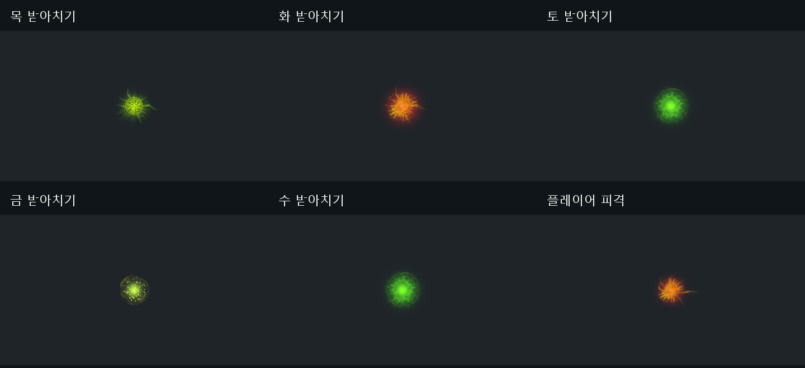

# KTP 받아치기·플레이어 피격 VFX 작업 결과

2026-09-10 · 구현 및 기술 검증 완료 · 비주얼 사용자 검토 대기

KTP Preview의 원본 Fly/Explosion 계층을 직접 참조하도록 연결했다. 원본의 색, 재질, 메시, 입자 계층, 방출량과 시간 곡선을 유지한다. 위치·방향·전체 배율과 복제본의 Hierarchy scaling만 맞췄다. 반복 광채는 원본 루트의 한 주기가 끝날 때 추가 방출을 멈추고 남은 입자는 자연 소멸한다.

- 성공 받아치기: 확정 접점에서 속성별 원본을 1회 재생한다.
- 반성공: 동일 원본을 절반 배율로 재생하며 보상은 추가하지 않는다.
- 플레이어 피격: 실제 양수 피해에만 원본을 재생한다. 무적 회피와 이미 사망한 상태에서는 생성하지 않고 치명타에서는 생성한다.
- 거·너 방어막: 기존 휘어짐/맥동은 유지하고 기존 NativeImpact 중복을 억제한다.
- 기존 씬은 Resources의 KTP_ContactProfile을 불러오므로 별도 씬 재저장 없이 적용된다. Inspector의 개별 프로필 지정도 지원한다.

## 검증

Unity 6000.3.9f1의 격리된 Play 씬에서 실제 ParryJudge.ResolveImpact → CombatLoopWiring 및 PlayerVitals.TakeDamage → Damaged 이벤트를 실행했다. 원본 연결·성공/반성공/실패/일반 방어·피격/0피해/무적/치명타·거/너 중복 억제·Update 재생·자연 소멸·비활성 정리를 포함한 107개 확인 항목이 통과했고, 테스트 오류는 0이었다. 컴파일 오류가 없으며 참조한 원본 프리팹 5개의 SHA-256이 제작 전후 동일하다. 6가지 표현을 4시점씩 촬영했다.

검사는 이벤트 경로와 실제 파티클 재생을 확인한 것으로, 적과 수동으로 싸운 전체 플레이나 다중 동시전투의 FPS 검사를 의미하지 않는다. 피격 이벤트에는 충돌점/방향이 없어 카메라 전방에 배치하며 실제 충돌점으로 주장하지 않는다. 검토 이미지는 접촉 표현을 보기 위해 정면 중앙으로 촬영했다. 미술 최종 판단은 사용자에게 남긴다.

Unity는 원래 KoreanTraditionalPattern_Effect/Scenes/Preview.unity의 편집 상태로 복귀했다. 사용자의 중단 지시에 따라 이 접촉 VFX 작업까지만 마쳤고, 다른 술식 제작을 시작하지 않는다.

근거: [Play 검사](ktp_contact_play_audit.json), [원본 출처/해시](ktp_contact_sources.json), [작업 사양](../../Docs/Specs/SPEC-KTP-CONTACT-VFX.md).
