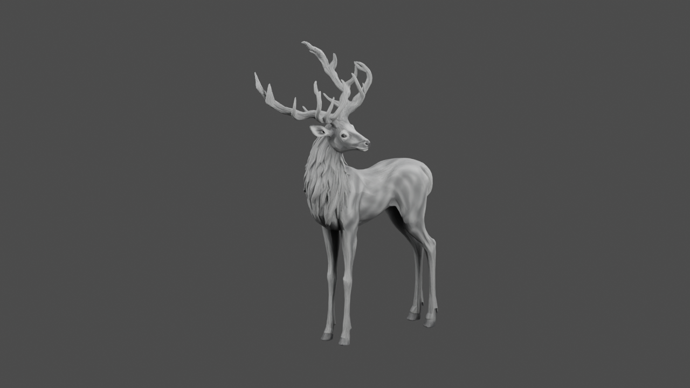
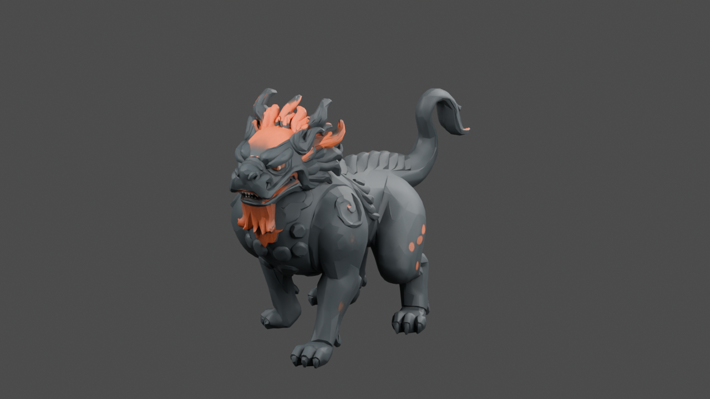
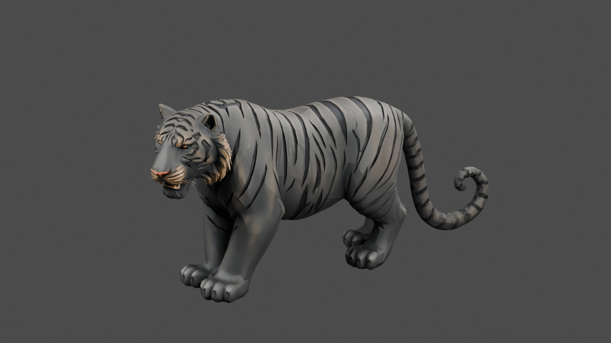

# Meshy 소환수 3종 Blender 정리·FBX 전달

2026-09-09. Blender 5.0.1 MCP에서 Meshy 7 refine GLB를 실제로 가져와 크기·방향·재질을 정리했다. 이 문서는 **정적 모델 전달 검사**이며, 소환수 리깅이나 Unity 런타임 완료 보고서가 아니다.

## 결과 파일

- 편집 원본: `MeshySummons_Source.blend`. 새 `MeshySummonsLab` 씬, 메시 3개, 재질 3개, 텍스처 9개가 패킹되어 있다. 처음 열 때 사슴만 표시되도록 다른 두 모델을 숨겼다. Outliner에서 `SM_Meshy_040_B188`, `SM_Meshy_088_C19C`를 표시하면 확인할 수 있다.
- Unity 전달: `Oheangbu/Assets/_Project/Art/SpellVFX120/MeshySummons/{id}/SM_Summon_{id}.fbx`, 각 폴더의 `Textures/` 5장.
- 원본과 출처: `../Source/{id}/refine/`, `../Source/delivery_manifest.json`, `../ledger.json`. 이번 Blender 단계의 추가 Meshy 요청과 비용은 0이다. 앞선 생성 단계는 5 preview와 3 refine, 실제 합계 155크레딧이었다. 반려된 몸·옴은 추가 제작하지 않았다.
- 실제 검수 렌더: `Review/{id}_{front,three_quarter,underside}.png`, 총 9장, 1280×720, 그림 내부 글자·라벨 없음.
- 수치 근거: `normalization.json`, `export_manifest.json`, `fbx_roundtrip.json`, `delivery_validation.json`, `preservation_validation.json`.

## 크기와 실제 메시 수

| 술식 / 모델 | 요청 polycount | 실제 export tris | 정점 | Blender 폭 × 길이 × 높이(m) | 재질 |
|---|---:|---:|---:|---|---:|
| 곰 / 016_ACF0 사슴 | 12,000 | 12,543 | 15,147 | 0.748 × 1.563 × 2.200 | 1 |
| 놈 / 040_B188 해태 | 12,000 | 12,532 | 15,885 | 0.978 × 2.271 × 1.550 | 1 |
| 솜 / 088_C19C 호랑이 | 12,000 | 12,414 | 18,138 | 1.085 × 3.067 × 1.400 | 1 |
| 합계 | 36,000 | **37,489** | **49,170** | — | 3 |

요청 수치를 실제 삼각형 수로 간주하지 않았다. GLB의 삼각형·UV와 원본 디자인을 유지하고 균일 스케일·회전·접지 기준 이동만 적용했다. 사슴은 원본 장축이 달라 Z축으로 90도 회전했다. 세 모델 모두 Blender에서 몸통 앞 방향 -Y, 위 +Z, XY 바운드 중심이 원점이며 최저점은 Z=0이다. 이는 모든 발이 지면에 닿는다는 뜻이 아니다. 해태의 들린 앞발 등 원본 자세는 보존했다.

사슴 2.2m는 **뿔을 포함한 전체 높이**다. 머리 자체의 정확한 1.8m 랜드마크는 따로 측정하지 않았다. FBX는 forward -Z / up +Y, 미터 단위, 리깅·애니메이션 없이 내보냈다. Unity가 실제로 읽는 방향은 Unity 측 임포트 검사에서 확인해야 한다.

## 재질 처리

원본 BaseColor·Normal·Metallic·Roughness 2K 이미지 12장을 그대로 복사하고 SHA-256 일치를 확인했다. 원본을 덮어쓰지 않았다. 별도 `Roughness_Min065` 3장은 원래 roughness에 `max(value,166/255)`를 적용했다. 실제 최솟값은 0.650980392이며, BaseColor는 sRGB, Normal·Roughness는 Non-Color로 연결했다. Normal 강도는 0.7이다.

Metallic은 사슴 0, 해태 0.05, 철 호랑이 0.5로 제한했다. 원본 metallic map은 보존하지만 현재 Blender 재질에는 연결하지 않았다. FBX의 상대 텍스처 경로는 최종 Unity 모델 폴더를 기준으로 작성했다. 빈 Blender 씬 재임포트에서 BaseColor·Normal·파생 Roughness 각 3종이 실제 2048×2048 이미지로 다시 연결됐다. Unity URP의 smoothness/metallic 채널 구성은 별도 연결 대상이다.

## 실제 렌더 관찰

- **016 사슴:** 네 다리, 갈라지는 뿔, 목의 섬유 덩어리, 발굽이 사선과 밑면에서 확인된다. 몸통은 정면을 향하지만 머리는 옆으로 돌린 원본 자세다. 몸 표면은 흰 털 동물로 읽히며, 요청한 오래된 뿌리·덩굴과 수피가 몸을 구성하는 표현은 부족하다. 나무 수호사슴의 최종 미술 통과로 판정하지 않는다.
- **040 해태:** 넓은 주둥이, 굽은 눈썹과 갈기, 네 발 및 말린 꼬리가 구별된다. 밑면에서 배·발바닥이 존재하고 대좌는 없다. 어깨·갈기·꼬리에는 면 경계가 남으며, 주황 갈기와 가슴의 장식은 해태 조각을 바탕으로 한 양식적 후보 수준이다. 모든 발이 같은 지면에 놓인 중립 자세는 아니다.
- **088 호랑이:** 넓은 얼굴, 둥근 네 발, 휘어진 등, 말린 꼬리, 입체 줄무늬가 구별된다. 밑면도 막힌 배·발바닥으로 읽히며 종이판이나 대좌 구조는 보이지 않는다. 금속성 줄무늬는 읽히지만 민화 호랑이의 과장된 비례보다는 실제 호랑이에 가깝다. 작은 볼털과 꼬리 곡면에는 면 경계가 남는다.

검수 조명은 중성 회색 배경과 면광원 3개, Cycles 16 samples/denoise였다. 실제 게임의 먹 셰이더·안개·거리에서 같은 색과 가독성을 보장하는 검사는 아니다.

## 검사 상태

| 항목 | 상태 | 근거 / 한계 |
|---|---|---|
| 기존 Blender 원본 보존 | 통과 | `SpellVFX120_MeshLab.blend` 작업 전후 SHA-256 동일: `de58e010186f0e0b71f006065ae458f44ba41d527cabb7cc8f62d73c542c6ba8` |
| 3종 별도 작업본·텍스처 패킹 | 통과 | 새 씬 1개, 메시 3개, 패킹 이미지 9개 |
| 원본 텍스처 복사·roughness 하한 | 통과 | 원본 12장 해시 일치, 파생 3장 실제 픽셀 최솟값 검사 |
| FBX 빈 씬 왕복 크기·tris | 통과 | 각 1메시, 원본 tris 동일. 바운드 최대 차이 사슴 3.5763e-7m, 해태·호랑이 2.3842e-7m. 허용 1e-5m |
| FBX UV·이미지 경로 | 통과 | 각 UV 1개, 연결 이미지 3종 존재·2K 확인 |
| 정면·사선·밑면 렌더 | 통과 | 9장을 실제 열람. 프레임별 카메라와 해시는 JSON에 기록 |
| 사슴의 뿌리·수피 미술 목표 | 실패 | 현재 흰 사슴 외형이 강하며 몸통의 나무 구조 부족 |
| 해태·호랑이 최종 미술 승인 | 미검증 | 후보의 읽힘은 관찰했으나 Unity 실제 VFX와 사용자 최종 승인은 별도 |
| 리깅·보행·타격·관절 변형 | 미검증 | 이번 단계에서 제작하지 않음. armature 0, animation 0 |
| Unity 방향·재질·VFX 런타임 | 미검증 | 이 작업에서는 Unity 실행·Refresh·씬 수정을 하지 않음 |

### 사선 렌더

